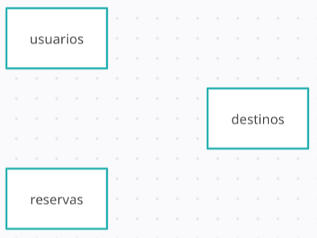
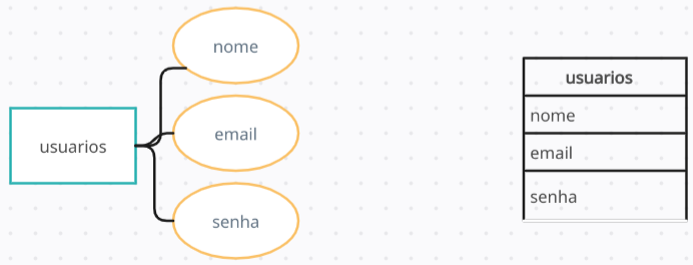
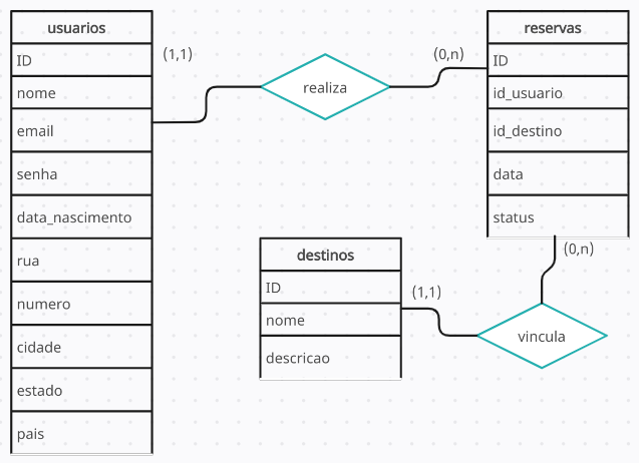
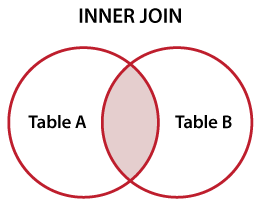
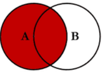
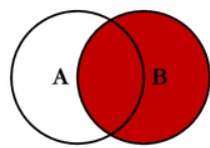
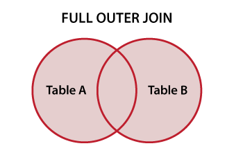

# Structured Query Language - SQL

Funcionalidades básicas de um SGBD:
**C**reate
**R**ead
**U**pdate
**D**elete
 
## Características
- Relationship between tables
- Structured Query Language (SQL)
- referential integrity
- Data normalization
- Security
- Flexibility and extensibility
- ACID transaction support

## SQL organization (Structured Query Language)

- DQL - Data Query Language
    + SELECT;
- DML - Data Manipulation Language 
    + INSERT, UPDATE e DELETE;
- DDL - Data Definition Language
    + CREATE, ALTER, DROP;
- DCL -Data Control Language
    + GRANT, REVOKE
- DTL - Data Transaction Language
    + BEGIN, COMMIT, ROLLBACK

## MER e DER
O Modelo Entidade-Relacionamento (MER) é representado através de diagramas chamados Diagramas Entidade-Relacionamento (DER).

### Entidades
As entidades são nomeadas com substantivos concretos ou abstratos que representem de forma clara sua função dentro do domínio.

### Atributos
Os atributos são as características ou propriedades das entidades. Eles descrevem informações específicas sobre uma entidade.

### Relacionamentos e Cardinalidade
Os relacionamentos representam as associações entre entidades e a cardinalidade a quantidade de associações:
- Relacionamento 1..1 (um para um)
- Relacionamento 1..n ou 1..* (um para muitos)
- Relacionamento n..n ou *..* (muitos para muitos)

### Comando: CREATE TABLE
CREATE TABLE {{nome}} 
({{coluna}} {{tipo}} {{opções}} COMMENT {{`COMENTARIO´}});

~~~SQL
CREATE TABLE usuarios (
  id INT,
  nome VARCHAR(255) NOT NULL COMMENT 'Nome do usuário',
  email VARCHAR(255) NOT NULL UNIQUE COMMENT 'Endereço de e-mail do usuário',
  data_nascimento DATE NOT NULL COMMENT 'Data de nascimento do usuário',
  endereco VARCHAR(50) NOT NULL COMMENT 'Endereço do Cliente'
);
~~~
Comandos que restringem valores:
+ NOT NULL
+ UNIQUE
+ DEFAULT
+ PRIMARY KEY
+ FOREIGN KEY
+ AUTO_INCREMENT

#### Tipos de Dados
Os dados variam de acordo com o SGBD, os mais comuns são:
+ Inteiro (Integer)
+ Decimal/Numérico (Decimal/Numeric)
+ Caractere/Varchar (Character/Varchar)
+ Data/Hora (Date/Time)
+ Booleano (Boolean)
+ Texto longo (Text)

### Comando: INSERT
**pode-se ocultar as colunas**

INSERT INTO
  {{ nome-tabela }}
  ([ coluna1, coluna2, … ])
VALUES
  ([ valor-coluna1, valor-coluna2, … ])

~~~SQL
-- Inserts --
INSERT INTO viagens.usuarios (id, nome, email, data_nascimento, endereco) VALUES 
(1, 'João Silva', 'joao@example.com', '1990-05-15', 'Rua A, 123, Cidade X, Estado Y'),
(2, 'Maria Santos', 'maria@example.com', '1985-08-22', 'Rua B, 456, Cidade Y, Estado Z'),
(3, 'Pedro Souza', 'pedro@example.com', '1998-02-10', 'Avenida C, 789, Cidade X, Estado Y');
~~~

### Comando: SELECT
SELECT * (lista_colunas) FROM tabela;

~~~SQL
-- SELECTs --
-- * retorna todas as colunas --
-- Selecionar todos os registros da tabela "usuarios" --
SELECT * FROM usuarios;

-- Selecionar apenas o nome e o email dos usuários --
SELECT nome, email FROM usuarios;

-- Selecionar os usuários que possuem o nome "João Silva"
SELECT * FROM usuarios WHERE nome = 'João Silva';

-- Selecionar os usuários que nasceram antes de uma determinada data --
SELECT * FROM usuarios WHERE data_nascimento < '1990-01-01';

-- Like --
SELECT * FROM usuarios WHERE nome LIKE '%Silva%';
SELECT * FROM usuarios WHERE nome LIKE 'Jo_o%';
~~~

### Operadores SQL
+ = (igualdade)
+ <> ou != (desigualdade)
+ > (maior que)
+ < (menor que)
+ >= (maior ou igual que)
+ <= (menor ou igual que)
+ LIKE (comparação de padrões)
+ IN (pertence a uma lista de valores)
+ BETWEEN (dentro de um intervalo)
+ AND (e lógico)
+ OR (ou lógico)

### Comando: UPDATE e DELETE
UPDATE {{ tabela }}
SET {{ coluna_1 }} = {{ novo_valor_1 }},
 {{ coluna_2 }} = {{ novo_valor_2 }}
WHERE
  {{ condicao }};

  DELETE FROM
        {{ tabela }}
WHERE
        {{ condicao }};

~~~SQL
-- Update --
UPDATE usuarios SET endereco = 'Nova Rua, 123' WHERE email = 'joao@example.com';

-- delete --
DELETE FROM reservas WHERE status = 'cancelada';
~~~

### Comando DROP TABLE
O comando DROP TABLE é usado no SQL - para remover uma tabela existente de um banco de dados relacional. Ele exclui permanentemente a tabela
DROP TABLE {{tabela}}
~~~SQL
-- Excluindo a tabela usuarios do database --
DROP TABLE usuarios;
~~~
### Comando ALTER TABLE
ALTER TABLE é usada no SQL para modificar a estrutura de uma tabela existente em um banco de dados relacional. Permite:
+ Adicionar, alterar ou excluir colunas
+ Modificar as restrições, índices
+ Renomear a tabela entre outras alterações
~~~SQL
-- Renomeando tabela --
ALTER TABLE usuarios_nova RENAME usuarios;

-- Alterar tamanho da coluna endereço -- 
ALTER TABLE usuarios MODIFY COLUMN endereco VARCHAR(100);
~~~
### PRIMARY KEY e FOREIGN KEY

~~~SQL
-- Modifica a coluna id para ser auto_incremento e adiciona chave primária ao id da Tabela reservas --
ALTER TABLE reservas
MODIFY COLUMN id INT AUTO_INCREMENT,
ADD PRIMARY KEY (id);

-- Adicionando chave estrangeira na tabela "reservas" referenciando a tabela "destinos" --
ALTER TABLE reservas
ADD CONSTRAINT fk_reservas_destinos
FOREIGN KEY (id_destino) REFERENCES destinos(id);
~~~

### JOINs

São usadas no SQL para combinar dados de duas ou mais tabelas relacionadas em uma única consulta.

Tipos de JOINs:

- INNER JOIN
- LEFT JOIN ou LEFT OUTER JOIN
- RIGHT JOIN ou RIGHT OUTER JOIN
- FULL JOIN ou FULL OUTER JOIN

#### INNER JOIN
Retorna apenas as linhas que têm correspondência em ambas as tabelas envolvidas na junção. A junção é feita com base em uma condição de igualdade especificada na cláusula ON.

SELECT * FROM tabela1 INNER JOIN tabela2 ON tabela1.coluna = tabela2.coluna;

#### LEFT JOIN ou LEFT OUTER JOIN
Retorna todas as linhas da tabela à esquerda da junção e as linhas correspondentes da tabela à direita. Se não houver correspondência, os valores da tabela à direita serão NULL.

SELECT * FROM tabela1 LEFT JOIN tabela2 ON tabela1.coluna = tabela2.coluna;

### RIGHT JOIN ou RIGHT OUTER JOIN
Retorna todas as linhas da tabela à direita da junção e as linhas correspondentes da tabela à esquerda. Se não houver correspondência, os valores da tabela à esquerda serão NULL.

SELECT * FROM tabela1 RIGHT JOIN tabela2 ON tabela1.coluna = tabela2.coluna;

### FULL JOIN ou FULL OUTER JOIN
Retorna todas as linhas de ambas as tabelas envolvidas na junção, combinando-as com base em uma condição de igualdade. Se não houver correspondência, os valores ausentes serão preenchidos com NULL.

SELECT * FROM tabela1 FULL JOIN tabela2 ON tabela1.coluna = tabela2.coluna;

### Ordenando resultados
~~~SQL
SELECT COUNT(*) FROM usuarios;

-- Media da idade dos usuarios --
SELECT AVG(TIMESTAMPDIFF(YEAR, data_nascimento, CURRENT_DATE())) AS idade
FROM usuarios;

-- Soma da idade dos usuarios --
SELECT SUM(TIMESTAMPDIFF(YEAR, data_nascimento, CURRENT_DATE())) AS media_idade
FROM usuarios;

-- Menor Idade --
SELECT MIN(TIMESTAMPDIFF(YEAR, data_nascimento, CURRENT_DATE())) AS media_idade
FROM usuarios;

-- Maior Idade --
SELECT MAX(TIMESTAMPDIFF(YEAR, data_nascimento, CURRENT_DATE())) AS media_idade
FROM usuarios;

-- Calcula quantidade de reservas por destino --
SELECT *, COUNT(*) AS total_reservas FROM reservas GROUP BY id_destino ;

-- Limit --
SELECT *, COUNT(*) AS total_reservas FROM reservas GROUP BY id_destino LIMIT 1 OFFSET 2;

SELECT *, COUNT(*) AS total_reservas FROM reservas GROUP BY id_destino LIMIT 1;

-- Ordenação --
SELECT nome
FROM usuarios
ORDER BY nome;

SELECT nome, data_nascimento
FROM usuarios
ORDER BY data_nascimento, nome;

SELECT nome, data_nascimento
FROM usuarios
ORDER BY data_nascimento, nome DESC;
~~~